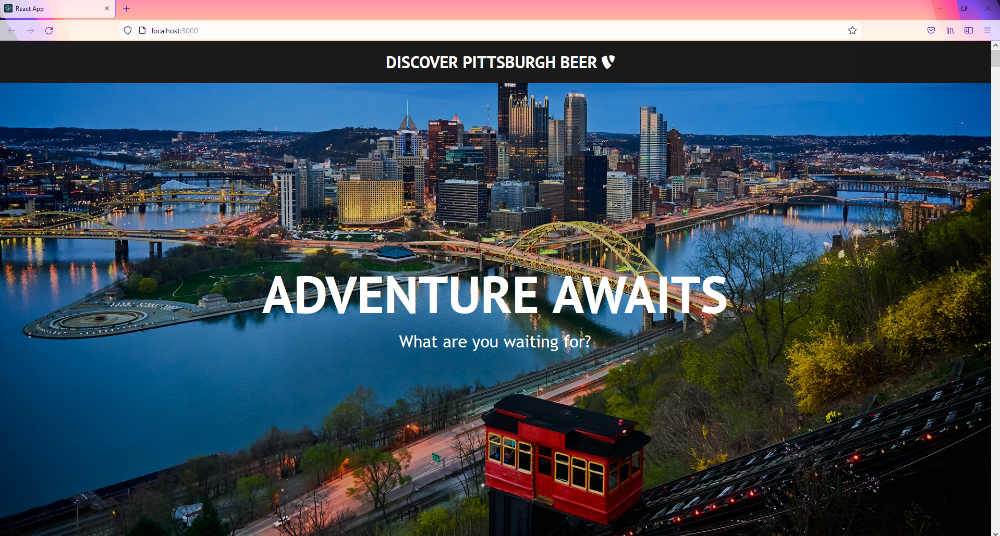
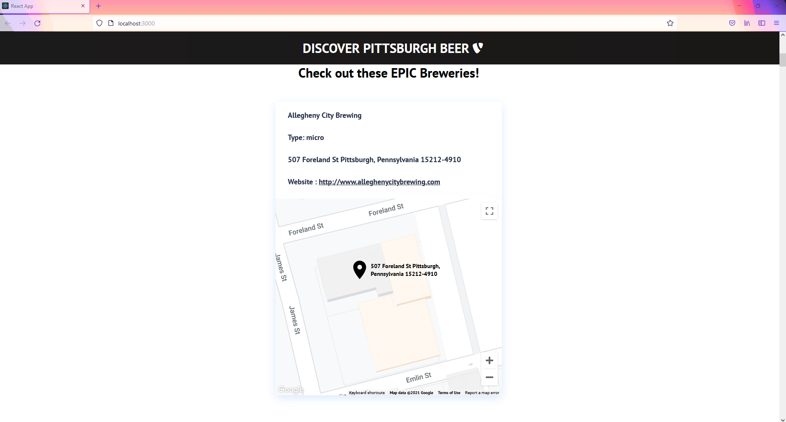
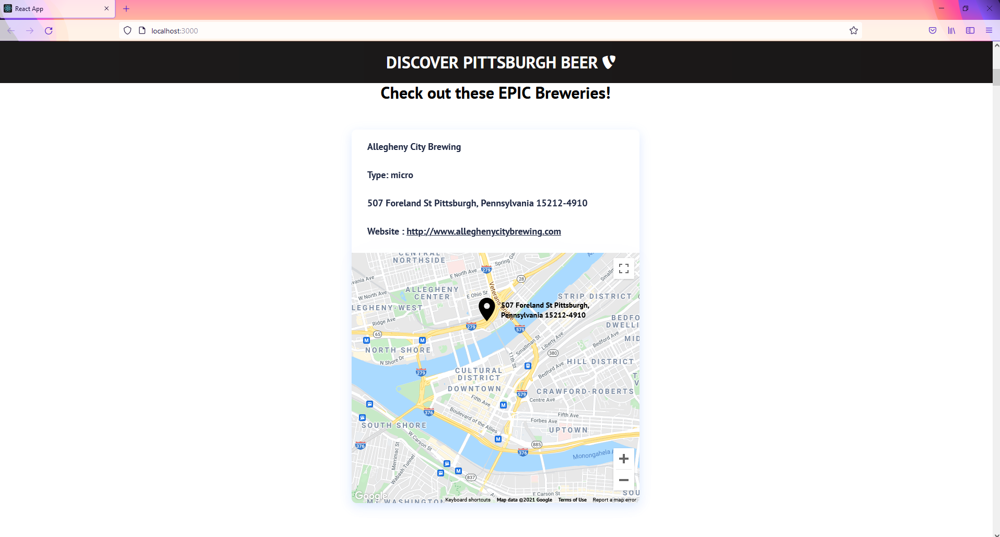

# ReactWebsiteSample
This is a React Website that pulls data from the Open Brewery API.

## System requirements

This sample requires:
 * [Node.js](https://nodejs.org/en/download/)
 * [GoogleMapAPI Key](https://developers.google.com/maps/documentation/javascript/get-api-key)

## Build and run the sample

### Description

This sample will be showing all the locations in Pittsburgh, PA (in ascending order).

Below is a list of some of the packages beening used:
 * axios
 * google-map-react
 * react-dom
 * react-router-dom
 * @iconify/react
 * @iconify/icons-mdi

You will need to add a GoogleMapAPI key withing the <strong>BreweryCardItem.js</strong> to be able to see the map and the marker.
```javascript

import React from "react";
import GoogleMapReact from "google-map-react";
import { Icon } from "@iconify/react";
import locationIcon from "@iconify/icons-mdi/map-marker";

import "./Map.css";

function CardItem(props) {
  ....
  );

  return (
    <>
      <li className="cards__item">
        <div className="cards__item__link">
          .......
          <div
            className="cards__item__info__map"
            style={{
              height: "100vh",
              width: "100%",
            }}
          >
            <GoogleMapReact
              key={props.mapkey}
              bootstrapURLKeys={{
                key: "ENTER YOUR API KEY HERE",
              }}
              center={location.center}
              defaultZoom={11.5}
              hoverDistance={400 / 20}
              yesIWantToUseGoogleMapApiInternals
            >
              <LocationPin
                lat={props.lat}
                lng={props.lng}
                text={[props.address]}
              />
            </GoogleMapReact>
          </div>
        </div>{" "}
      </li>{" "}
    </>
  );
}

export default CardItem;

```

### Steps

1. Execute `npm install react`
2. Execute `npm start`
2. Open http://localhost:3000 by browser

### Sample output



### GoogleMap and Marker

When you scroll down past the hero section, you will have a list of breweries pull from Open Brewery API.  On the map you will notice a zoomed out view of the city of Pittsburgh.  To see the markers location, you can zoom in or out and the marker will adjust based on the zoom level.  Below is an example of what the marker looks when it is zoomed in and zoom out.

#### Zoomed in


#### Zoomed out

